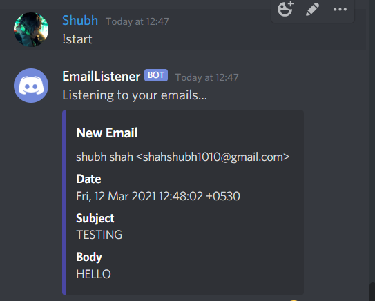
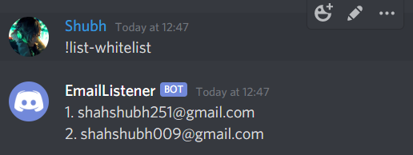

# Email Listener
A discord bot to keep a check on incoming emails and notify if email is from whitelisted users. Also add it to different folders to access it easily later from Gmail.


### Screenshots






### How to Run
- Clone this repo by `git clone https://github.com/shahshubh/EmailListener.git`
- create a .env file in the root directory and add
```
TOKEN=your-discord-bot-token
EMAIL=your-gmail-id
PASS=your-gmail-password
```
- Finally, in cmd run `python main.py`

